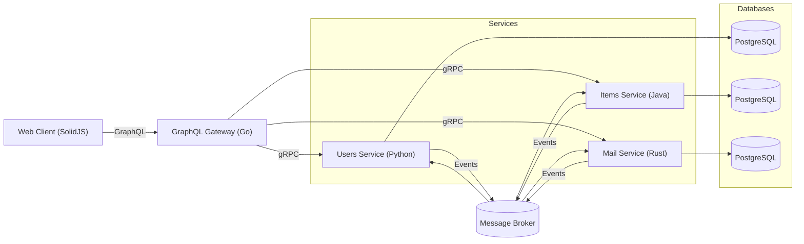

```mermaid
flowchart LR

Client["Web Client (SolidJS)"]
Gateway["GraphQL Gateway (Go)"]

subgraph Services
Users["Users Service (Python)"]
Items["Items Service (Java)"]
Mail["Mail Service (Rust)"]
end

subgraph Databases
UsersDB[(PostgreSQL)]
ItemsDB[(PostgreSQL)]
MailDB[(PostgreSQL)]
end

Broker[("Message Broker")]

Client -->|GraphQL| Gateway

Gateway -->|gRPC| Users
Gateway -->|gRPC| Items
Gateway -->|gRPC| Mail

Users --> UsersDB
Items --> ItemsDB
Mail --> MailDB

Users -->|Events| Broker
Items -->|Events| Broker
Mail -->|Events| Broker

Broker --> Users
Broker --> Items
Broker --> Mail
```
